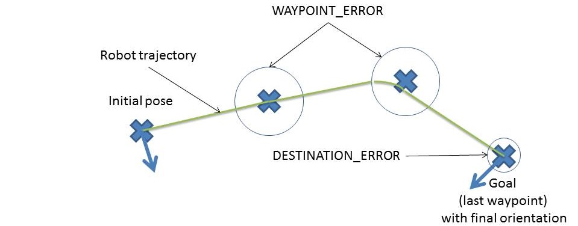
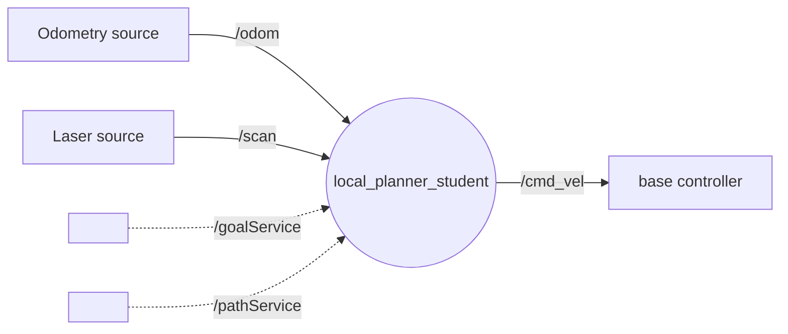
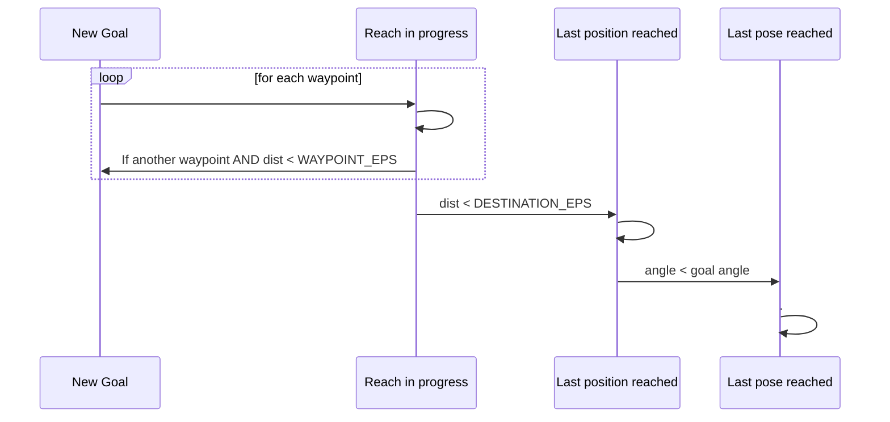

# local_planner_student

Le but de ce TP est de coder un "local planner" sur la base du template fourni : [local_planner.py](local_planner_student/local_planner_student/local_planner.py)
Ce fichier NE FONCTIONNE DONC PAS EN L'ETAT. Il faut d'abord compléter toutes les balises `#TODO` après avoir lu tout ce README d'explication.    

Voici le schéma de principe du fonctionnement de ce "local planner" : 

|  |
|:-------:|
| *local_planner_student basic principle for a differential drive robot like turtlebot* |


Ce "local planner" fonctionne (une fois complété :smile:) avec un robot à base différentielle.
- Entrées : 
  - Capteurs : topics `/odom` et `/scan`
  - Ordre : services `/goalService` ou `/pathService` 
- Sorties : commande en velocité envoyée sur le topic `/cmd_vel` :




Le turtelbot est tout trouvé pour cet usage. L'utilisation d'un simulateur facilitera la réalisation du TP. Nous utiliserons le robot turtlebot dans le simulateur stage. La procédure de lancement se trouve dans [la partie du TP gérée par Jacques Saraydaryan](https://github.com/jacques-saraydaryan/global_planner_short_path_student)

Pour piloter le robot, votre noeud doit pouvoir traiter les 2 services suivants :
+ un Goal sur `goalService`
  - Ce service recoit un message `goalPose2D` de type `geometry_msgs/Pose2D` et répond le message `possible` de type `std_msgs/Bool` donnant la faisabilité de la consigne demandée (on ne fera que vérifier de manière simpliste qu'il n'y a pas d'obstable dans la zone OBSTACLE_RANGE). Les messages du service sont dans le fichier [localGoal.srv](local_planner_srvs/srv/LocalGoal.srv) dans le paquet local_planner_srvs.
  - La consigne `goal_pose2d` est exprimée en absolue dans le repère de la TF odom
  - Le plus simple pour appeler ce service est d'utiliser la commande suivante :
    ```{r, engine='bash', count_lines} 
    ros2 service call /goalService local_planner_srvs/srv/LocalGoal "{
      'goal_pose2d': {
        'x': 1.0,
        'y': 1.0,
        'theta': 0.0
      }
    }"
    ```
+ un Path sur `/pathService`
  - Ce service reçoit un message `path_to_goal` de type `nav_msgs/Path` et répond le message `success` de type `std_msgs/Bool` renseignant le succès ou l'échec de prise en compte de la liste de waypoints (ne garantis pas qu'elle sera bien effectuée sans obstacles) Les messages du service sont dans le fichier [PathToGoal.srv](local_planner_srvs/srv/PathToGoal.srv) dans le paquet local_planner_srvs.
  - Le message étant long et difficile à écrire en console, utilisez le noeud path_generator fourni avec le template. 
      ```{r, engine='bash', count_lines} 
      ros2 run local_planner_student testPathGenerator
      ```
      Le code source du générateur se trouve dans le fichier [testPathGenerator.py](local_planner_raph/local_planner_raph/testPathGenerator.py)
  - La consigne `path_to_goal` est exprimée en absolue dans n'importe quel repère à définir dans `header.frame_id` . Dans le cas du générateur, le `frame_id` envoyé est celui de la `/map`. **Attention** : A sa reception, la pose devra être convertie dans le repère de la TF odom. Cela peut se faire en une ligne avec la méthode `do_transform_pose` avec la transformation issue de la methode `lookup_transform`.

Pour évaluer le déplacement et l'environnement proche, votre noeud doit s'abonner aux 2 topics suivants :
+ /scan pour vérifier qu'il n'y ait pas d'obstacle
  - Pour faire simple, si un des points du laser a un obstacle à moins d'une valeur défini en ROSPARAM lors de l'execution d'un service, on considère qu'un obstacle empêche le succès de ce service. On affichera un log avec la distance de l'obstacle ainsi que l'angle de sa detection, une fois sur 100
+ /odom pour connaitre la position relative du robot par rapport à la tf odom


Pour déplacer le robot, vous devrez publier un topic de commande en velocité:
+ `/cmd_vel` de type twist pour piloter le robot en vitesse
  - Merci d'utiliser à cet effet les ROSPARAM `SAT_LINEAR` et `SAT_ANGULAR` passés au contructeur de localPlanner. Inspirez-vous ce qui est déjà fait avec `K_LINEAR`, `K_ANGULAR`. 
  - Prenez en compte aussi `ANGLE_TO_ALLOW_LINEAR` qui est un angle en radian au-dessus duquel on n'authorise pas de mouvement linéaire.   
  
Plus globalement, prenez en compte chacun des ROSPARAM passés au contructeur de localPlanner:

```python
        # Proportionnal coefficient for linear velocity
        self.K_linear = self.get_parameter('K_LINEAR').get_parameter_value().double_value or 1.0
        # Proportionnal coefficient for angular velocity
        self.K_angular = self.get_parameter('K_ANGULAR').get_parameter_value().double_value or 4.0
        # Max linear velocity
        self.Sat_linear = self.get_parameter('SAT_LINEAR').get_parameter_value().double_value or 2.0
        # Max angular velocity
        self.Sat_angular = self.get_parameter('SAT_ANGULAR').get_parameter_value().double_value or (3.14159265359 / 2.0)  # Approximation of pi
        # Distance below which we consider an obstacle
        self.Obstacle_range = self.get_parameter('OBSTACLE_RANGE').get_parameter_value().double_value or 0.5
        # Above this value: angular control only. Below this value: angular and linear control together
        self.Angle_to_allow_linear = self.get_parameter('ANGLE_TO_ALLOW_LINEAR').get_parameter_value().double_value or 0.2
        # Euclidian distance error to a waypoint allowing to move to a new waypoint
        self.Waypoint_eps = self.get_parameter('WAYPOINT_EPS').get_parameter_value().double_value or 0.16
        # Euclidian distance error to the final waypoint below which we consider the position reached
        self.Destination_eps = self.get_parameter('DESTINATION_EPS').get_parameter_value().double_value or 0.003
        # Angular error below which we consider the final orientation reached
        self.Angle_eps = self.get_parameter('ANGLE_EPS').get_parameter_value().double_value or 0.2
```  
  


Voici la machine d'état permettant de passer d'un waypoint à un autre :


 


Imprégnez-vous de la structure du code. Complétez le template. Des commentaires `#TODO` indique dans les grandes lignes ce qu'il faut faire. Il est possible également de refaire tout le code (pas recommandé dans le temps imparti).
Commencez par les `#TODO` des callbacks de topics. Continuez par tous les autres `#TODO`. Celui de la méthode `path_service_callback` peut se faire éventuellement dans un second temps.

En effet, avant de tester le service associé à `path_service_callback` (`/pathService`), il faudra d'abord tester le service associé à `goal_service_callback` (`/goalService`), qui est nettement plus simple (un goal, plutôt qu'une liste de waypoints).

Lorque le progrmamme fonctionne bien avec le service `/goalService`, ajoutez la fonctionnalité du service `/pathService`. Pour finir veillez à l'orientation finale.


# FAQ

## Errors

### tf_transforms

> :x: ModuleNotFoundError: No module named 'tf_transformations'
```bash
# Install this 
pip3 install transforms3d

# Then...

# if you are root do this :
sudo apt-get install ros-humble-tf-transformations

# if you are not root, clone and build the sources in your workspace src folder :
git clone git@github.com:DLu/tf_transformations.git
```


## Commands

### Service /goalService

```bash
ros2 service call /goalService local_planner_srvs/srv/LocalGoal "{
  'goal_pose2d': {
    'x': 1.0,
    'y': 1.0,
    'theta': 0.0
  }
}"
```
